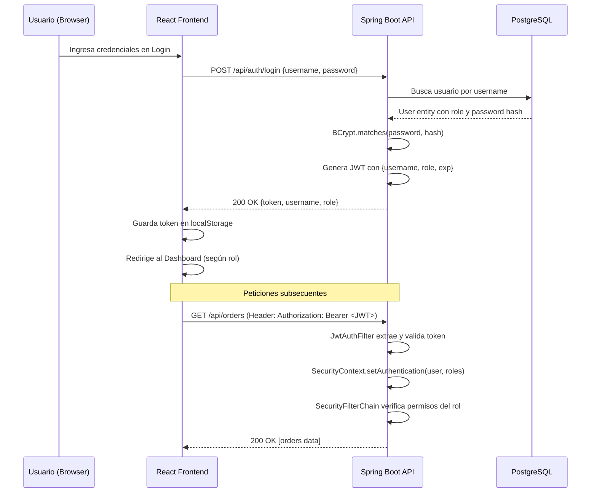

# 🔐 Login con Roles — Spring Security + JWT

## Contexto

El sistema actual es un CRUD full-stack (Spring Boot 4.0.6 + React 19) **sin ningún tipo de autenticación**. Todos los endpoints REST son públicos. Se necesita agregar un sistema de login con **3 roles**: **Administrador**, **Cajero** y **Mesero**, usando Spring Security con JWT (JSON Web Tokens).

> [!IMPORTANT]
> **Spring Boot 4.0.6** trae Spring Security 7.x internamente. La API de configuración usa el estilo lambda DSL (`authorizeHttpRequests`, `sessionManagement`, etc.) y elimina métodos deprecados de versiones anteriores. Usaremos la librería `jjwt` (io.jsonwebtoken) para generar y validar tokens JWT.

---

## User Review Required

> [!WARNING]
> ### Matriz de Permisos por Rol
> Necesito tu confirmación sobre qué puede hacer cada rol. Esta es mi propuesta basada en la lógica de negocio de una tienda/restaurante:

| Endpoint | ADMIN | CAJERO (CASHIER) | MESERO (WAITER) |
|---|:---:|:---:|:---:|
| **Productos** — Ver catálogo (`GET /api/products`) | ✅ | ✅ | ✅ |
| **Productos** — Crear/Editar/Eliminar | ✅ | ❌ | ❌ |
| **Clientes** — Ver todos (`GET /api/customer`) | ✅ | ✅ | ✅ |
| **Clientes** — Crear/Editar/Eliminar | ✅ | ✅ | ❌ |
| **Órdenes** — Ver todas (`GET /api/orders`) | ✅ | ✅ | ✅ |
| **Órdenes** — Crear (`POST /api/orders`) | ✅ | ✅ | ✅ |
| **Órdenes** — Editar (`PUT /api/orders/{id}`) | ✅ | ✅ | ✅ |
| **Órdenes** — Eliminar (`DELETE /api/orders/{id}`) | ✅ | ✅ | ❌ |
| **Usuarios** — CRUD completo | ✅ | ❌ | ❌ |

> [!IMPORTANT]
> ### Sidebar del Frontend por Rol
> Propuesta de qué pestañas ve cada rol en la UI:

| Pestaña | ADMIN | CAJERO | MESERO |
|---|:---:|:---:|:---:|
| Órdenes | ✅ | ✅ | ✅ |
| Clientes | ✅ | ✅ | ❌ |
| Productos | ✅ | ❌ | ❌ |
| Usuarios (NUEVA) | ✅ | ❌ | ❌ |

---

## Open Questions

> [!IMPORTANT]
> 1. **¿Estás de acuerdo con la matriz de permisos de arriba?** Si querés que algún rol tenga más o menos acceso, decime y lo ajusto.
> 2. **¿Querés un usuario ADMIN por defecto "semilla"** que se cree automáticamente al iniciar la app? (Recomendado: `admin / admin123`). Así siempre tenés acceso al sistema sin depender de un registro manual en BD.
> 3. **¿El módulo de "Usuarios" (CRUD)** lo queremos implementar en esta fase, o preferís que el ADMIN por ahora solo se cree por semilla y el CRUD de usuarios queda para después?

---

## Arquitectura del Flujo de Autenticación



---

## Proposed Changes

### 1. Dependencias Maven (Backend)

#### [MODIFY] [pom.xml](file:///c:/Users/jhoni/OneDrive/Documentos/Desktop/Quinto%20semestre%20Jhonier/Lenguaje%203/lenguajesP33/lenguajesP3/backend/pom.xml)

Agregar 3 dependencias nuevas:

```xml
<!-- Spring Security -->
<dependency>
    <groupId>org.springframework.boot</groupId>
    <artifactId>spring-boot-starter-security</artifactId>
</dependency>

<!-- JWT (JJWT by io.jsonwebtoken) -->
<dependency>
    <groupId>io.jsonwebtoken</groupId>
    <artifactId>jjwt-api</artifactId>
    <version>0.12.6</version>
</dependency>
<dependency>
    <groupId>io.jsonwebtoken</groupId>
    <artifactId>jjwt-impl</artifactId>
    <version>0.12.6</version>
    <scope>runtime</scope>
</dependency>
<dependency>
    <groupId>io.jsonwebtoken</groupId>
    <artifactId>jjwt-jackson</artifactId>
    <version>0.12.6</version>
    <scope>runtime</scope>
</dependency>
```

---

### 2. Módulo `auth` (Backend — NUEVO)

Nuevo módulo en `modules/auth/` siguiendo el patrón existente del proyecto.

#### [NEW] `modules/auth/model/Role.java` — Enum de roles

```java
public enum Role {
    ROLE_ADMIN,
    ROLE_CASHIER,
    ROLE_WAITER
}
```

#### [NEW] `modules/auth/model/User.java` — Entidad JPA

Entidad que implementa `UserDetails` de Spring Security. Campos:
- `id` (Long, auto-generated)
- `username` (String, unique, not null)
- `password` (String, BCrypt hash)
- `fullName` (String)
- `role` (Enum Role)
- `enabled` (Boolean, default true)

Tabla: `table_users` (sigue la convención `table_` del proyecto).

#### [NEW] `modules/auth/repository/UserRepository.java`

```java
public interface UserRepository extends JpaRepository<User, Long> {
    Optional<User> findByUsername(String username);
    boolean existsByUsername(String username);
}
```

#### [NEW] `modules/auth/service/JwtService.java`

Servicio que encapsula toda la lógica JWT:
- `generateToken(UserDetails)` — genera un JWT con claims: `sub` (username), `role`, `iat`, `exp`
- `extractUsername(String token)` — extrae el subject del token
- `extractRole(String token)` — extrae el rol
- `isTokenValid(String token, UserDetails)` — valida expiración y que coincida con el usuario
- Secret key configurable desde `application.properties`: `jwt.secret` y `jwt.expiration`

#### [NEW] `modules/auth/service/AuthService.java`

Lógica de negocio para login:
- `login(LoginRequest)` → valida credenciales con `AuthenticationManager`, genera JWT, retorna `AuthResponse`
- `register(RegisterRequest)` → solo accesible para ADMIN, crea un nuevo usuario con BCrypt

#### [NEW] `modules/auth/dto/LoginRequest.java`

```java
@Data
public class LoginRequest {
    private String username;
    private String password;
}
```

#### [NEW] `modules/auth/dto/RegisterRequest.java`

```java
@Data
public class RegisterRequest {
    private String username;
    private String password;
    private String fullName;
    private String role; // "ADMIN", "CASHIER", "WAITER"
}
```

#### [NEW] `modules/auth/dto/AuthResponse.java`

```java
@Data @Builder
public class AuthResponse {
    private String token;
    private String username;
    private String fullName;
    private String role;
}
```

#### [NEW] `modules/auth/controller/AuthController.java`

```
POST /api/auth/login   → público, retorna JWT
POST /api/auth/register → solo ADMIN, crea usuarios
GET  /api/auth/me       → autenticado, retorna datos del usuario actual
```

---

### 3. Configuración de Seguridad (Backend — NUEVO)

#### [NEW] `modules/auth/config/SecurityConfig.java`

Configuración central de Spring Security:
- `SecurityFilterChain` con las reglas de acceso por endpoint y rol
- Deshabilita CSRF (API REST stateless)
- Sesión STATELESS (sin cookies de sesión)
- Registra el `JwtAuthFilter` antes del `UsernamePasswordAuthenticationFilter`
- Expone `AuthenticationManager` y `PasswordEncoder` (BCrypt) como beans

```java
@Bean
public SecurityFilterChain securityFilterChain(HttpSecurity http) throws Exception {
    http
        .csrf(csrf -> csrf.disable())
        .sessionManagement(session -> session
            .sessionCreationPolicy(SessionCreationPolicy.STATELESS))
        .authorizeHttpRequests(auth -> auth
            // Endpoints públicos
            .requestMatchers("/api/auth/login").permitAll()
            .requestMatchers("/", "/swagger-ui/**", "/v3/api-docs/**").permitAll()
            
            // Productos — CRUD solo ADMIN, lectura para todos autenticados
            .requestMatchers(HttpMethod.GET, "/api/products/**").authenticated()
            .requestMatchers("/api/products/**").hasRole("ADMIN")
            
            // Clientes — CRUD para ADMIN y CASHIER, lectura para todos
            .requestMatchers(HttpMethod.GET, "/api/customer/**").authenticated()
            .requestMatchers("/api/customer/**").hasAnyRole("ADMIN", "CASHIER")
            
            // Órdenes — crear/editar para todos, eliminar solo ADMIN y CASHIER
            .requestMatchers(HttpMethod.DELETE, "/api/orders/**").hasAnyRole("ADMIN", "CASHIER")
            .requestMatchers("/api/orders/**").authenticated()
            
            // Registro de usuarios — solo ADMIN
            .requestMatchers("/api/auth/register").hasRole("ADMIN")
            
            // Todo lo demás requiere autenticación
            .anyRequest().authenticated()
        )
        .addFilterBefore(jwtAuthFilter, UsernamePasswordAuthenticationFilter.class);
    return http.build();
}
```

#### [NEW] `modules/auth/config/JwtAuthFilter.java`

Filtro que intercepta CADA request HTTP:
1. Extrae el header `Authorization: Bearer <token>`
2. Valida el JWT con `JwtService`
3. Si es válido, crea un `UsernamePasswordAuthenticationToken` con el usuario y sus roles
4. Lo inyecta en el `SecurityContextHolder`
5. Si no hay token o es inválido, deja pasar (Spring Security rechazará si el endpoint requiere auth)

#### [NEW] `modules/auth/config/DataSeeder.java`

`CommandLineRunner` que al iniciar la app crea el usuario admin por defecto si no existe:

```java
@Component
@RequiredArgsConstructor
public class DataSeeder implements CommandLineRunner {
    @Override
    public void run(String... args) {
        if (!userRepository.existsByUsername("admin")) {
            User admin = User.builder()
                .username("admin")
                .password(passwordEncoder.encode("admin123"))
                .fullName("Administrador")
                .role(Role.ROLE_ADMIN)
                .enabled(true)
                .build();
            userRepository.save(admin);
        }
    }
}
```

---

### 4. Modificaciones al Backend Existente

#### [MODIFY] [LenguajesP3Application.java](file:///c:/Users/jhoni/OneDrive/Documentos/Desktop/Quinto%20semestre%20Jhonier/Lenguaje%203/lenguajesP33/lenguajesP3/backend/src/main/java/com/edu/uniremintong/jchica/lenguajesP3/LenguajesP3Application.java)

- **Eliminar** el `Bean corsConfigurer()` de acá. La configuración CORS se mueve a `SecurityConfig` para que Spring Security la maneje correctamente (si CORS está por fuera de Security, el filtro de seguridad puede bloquear los preflight OPTIONS antes de que CORS los permita).

#### [MODIFY] [application.properties](file:///c:/Users/jhoni/OneDrive/Documentos/Desktop/Quinto%20semestre%20Jhonier/Lenguaje%203/lenguajesP33/lenguajesP3/backend/src/main/resources/application.properties)

Agregar configuración JWT:

```properties
# JWT Configuration
jwt.secret=tu-clave-secreta-super-segura-de-al-menos-256-bits-para-hmac-sha
jwt.expiration=86400000
```

> `86400000ms` = 24 horas de validez del token.

---

### 5. Frontend — Tipos TypeScript

#### [MODIFY] [index.ts](file:///c:/Users/jhoni/OneDrive/Documentos/Desktop/Quinto%20semestre%20Jhonier/Lenguaje%203/lenguajesP33/lenguajesP3/frontend/src/types/index.ts)

Agregar interfaces de autenticación:

```typescript
export type UserRole = 'ADMIN' | 'CASHIER' | 'WAITER';

export interface AuthUser {
  token: string;
  username: string;
  fullName: string;
  role: UserRole;
}

export interface LoginCredentials {
  username: string;
  password: string;
}
```

---

### 6. Frontend — Cliente HTTP con JWT

#### [MODIFY] [api.ts](file:///c:/Users/jhoni/OneDrive/Documentos/Desktop/Quinto%20semestre%20Jhonier/Lenguaje%203/lenguajesP33/lenguajesP3/frontend/src/lib/api.ts)

Modificar la función `request()` para inyectar automáticamente el token JWT:

```typescript
async function request<T>(path: string, options?: RequestInit): Promise<T> {
  const token = localStorage.getItem('auth_token');
  const headers: Record<string, string> = {
    'Content-Type': 'application/json',
  };
  if (token) {
    headers['Authorization'] = `Bearer ${token}`;
  }

  const res = await fetch(`${API_BASE}${path}`, {
    headers,
    ...options,
  });

  // Si el servidor retorna 401/403, limpiar sesión y redirigir al login
  if (res.status === 401 || res.status === 403) {
    localStorage.removeItem('auth_token');
    localStorage.removeItem('auth_user');
    window.location.reload();
    throw new Error('Sesión expirada');
  }

  if (!res.ok) {
    const text = await res.text();
    throw new Error(text || res.statusText);
  }
  if (res.status === 204) return {} as T;
  return res.json();
}
```

---

### 7. Frontend — AuthContext (NUEVO)

#### [NEW] `context/AuthContext.tsx`

React Context que maneja todo el estado de autenticación:
- `user: AuthUser | null` — datos del usuario logueado
- `login(credentials)` — llama a `POST /api/auth/login`, guarda token en localStorage
- `logout()` — limpia localStorage y resetea estado
- `isAuthenticated` — boolean derivado
- `hasRole(role)` — helper para verificar permisos

Se inicializa leyendo `localStorage` para persistir la sesión entre recargas.

---

### 8. Frontend — Pantalla de Login (NUEVA)

#### [NEW] `pages/LoginPage.tsx`

Pantalla de login con diseño premium que sigue el design system existente (Outfit font, tokens HSL, rounded-3xl, shadows):
- Input de usuario y contraseña con el estilo de los formularios actuales
- Botón primario con shadow y hover scale
- Logo de la tienda
- Manejo de errores con toast (Sonner)
- Animación de entrada

---

### 9. Frontend — App.tsx (Modificación Principal)

#### [MODIFY] [App.tsx](file:///c:/Users/jhoni/OneDrive/Documentos/Desktop/Quinto%20semestre%20Jhonier/Lenguaje%203/lenguajesP33/lenguajesP3/frontend/src/App.tsx)

Cambios:
1. **Wrappear** con `<AuthProvider>` en `main.tsx`
2. **Renderizado condicional**: Si no hay usuario autenticado → mostrar `<LoginPage />`. Si hay usuario → mostrar el dashboard actual
3. **Filtrar `menuItems`** según el rol del usuario:
   - ADMIN: ve todo (Órdenes, Clientes, Productos + Usuarios)
   - CASHIER: ve Órdenes y Clientes
   - WAITER: ve solo Órdenes
4. **Agregar botón de logout** en el sidebar footer con el nombre del usuario y su rol
5. **Mostrar info del usuario** en el header desktop (nombre + badge de rol)

#### [MODIFY] [main.tsx](file:///c:/Users/jhoni/OneDrive/Documentos/Desktop/Quinto%20semestre%20Jhonier/Lenguaje%203/lenguajesP33/lenguajesP3/frontend/src/main.tsx)

Envolver `<App />` con `<AuthProvider>`:

```tsx
<StrictMode>
  <AuthProvider>
    <App />
  </AuthProvider>
</StrictMode>
```

---

## Estructura de Archivos Nuevos

```
backend/src/main/java/.../modules/auth/
├── config/
│   ├── SecurityConfig.java      ← SecurityFilterChain + CORS + Beans
│   ├── JwtAuthFilter.java       ← Filtro HTTP para validar JWT
│   └── DataSeeder.java          ← Crea admin por defecto al iniciar
├── controller/
│   └── AuthController.java      ← /api/auth/login, /register, /me
├── dto/
│   ├── LoginRequest.java
│   ├── RegisterRequest.java
│   └── AuthResponse.java
├── model/
│   ├── User.java                ← Entidad JPA + UserDetails
│   └── Role.java                ← Enum (ADMIN, CASHIER, WAITER)
├── repository/
│   └── UserRepository.java
└── service/
    ├── AuthService.java         ← Lógica de login/registro
    └── JwtService.java          ← Generación/validación JWT

frontend/src/
├── context/
│   └── AuthContext.tsx           ← Estado global de autenticación
└── pages/
    └── LoginPage.tsx             ← Pantalla de login
```

---

## Impacto en Código Existente

> [!NOTE]
> ### Lo que NO se toca
> - Las entidades `Customer`, `Product`, `Order`, `OrderItem` → **intactas**
> - Los servicios existentes (`CustomerService`, `ProductService`, `OrderService`) → **intactos**
> - Los repositorios existentes → **intactos**
> - Los controladores existentes → **intactos** (la seguridad se aplica desde `SecurityConfig` a nivel de ruta, no dentro de los controllers)
> - Los componentes de UI (`Products.tsx`, `Customers.tsx`, `Orders.tsx`) → **intactos**
> - Los componentes UI base (`button.tsx`, `card.tsx`, etc.) → **intactos**

> [!WARNING]
> ### Lo que SÍ se modifica (mínimo)
> 1. **`pom.xml`** — se agregan dependencias (Spring Security + JJWT)
> 2. **`application.properties`** — se agregan 2 líneas para JWT config
> 3. **`LenguajesP3Application.java`** — se mueve CORS a SecurityConfig (el bean `corsConfigurer` se elimina de acá)
> 4. **`api.ts`** — se agrega header `Authorization` automático
> 5. **`types/index.ts`** — se agregan tipos de Auth
> 6. **`main.tsx`** — se envuelve con `AuthProvider`
> 7. **`App.tsx`** — se agrega lógica de login/logout y filtrado de sidebar por rol

---

## Verification Plan

### Compilación y Arranque
- El backend compila sin errores con `mvnw.cmd spring-boot:run`
- El frontend compila sin errores con `pnpm run dev`
- La tabla `table_users` se crea automáticamente en PostgreSQL (ddl-auto=update)
- El usuario `admin/admin123` se crea al arrancar (DataSeeder)

### Flujo de Login
- `POST /api/auth/login` con credenciales válidas retorna JWT + datos del usuario
- `POST /api/auth/login` con credenciales inválidas retorna 401
- La pantalla de login funciona y redirige al dashboard

### Protección de Endpoints
- Sin token → todos los endpoints (excepto `/api/auth/login`) retornan 401
- Con token de WAITER → solo puede ver/crear/editar órdenes y ver productos/clientes
- Con token de CASHIER → puede gestionar órdenes + clientes, ver productos
- Con token de ADMIN → acceso total

### Frontend por Rol
- ADMIN ve 4 pestañas (Órdenes, Clientes, Productos, Usuarios)
- CASHIER ve 2 pestañas (Órdenes, Clientes)
- WAITER ve 1 pestaña (Órdenes)
- El botón de logout funciona y vuelve al login

### Swagger
- `/swagger-ui/index.html` sigue accesible sin autenticación
